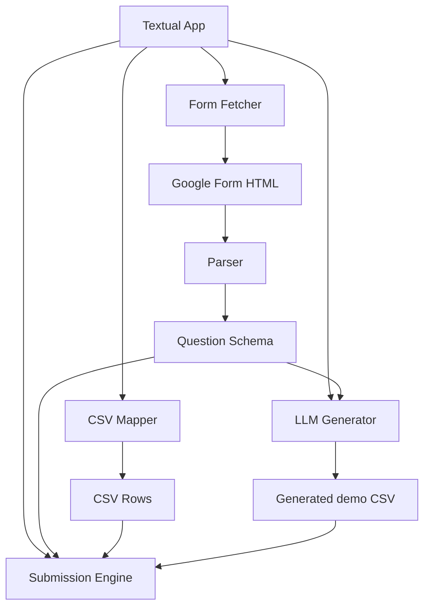

# Technical Design Document

## 1. Executive summary

This project implements a compact Python utility called `gform-filler` that can analyze a public Google Form, map a CSV file to the form fields, and submit one response per row through a real Chromium browser using Playwright. The application is intentionally lightweight and constrained to a Linux sandbox with limited RAM, disk, and no persistent GUI. It includes a Textual TUI so a user can paste a form URL, inspect the parsed schema, and trigger either a CSV-driven submission or a generated demo-data workflow.

The architecture keeps the browser automation, parsing logic, and LLM-based demo generation isolated in separate modules so the app remains maintainable under a short delivery window and within the sandboxed environment constraints.

## 2. Objectives (primary + non-goals)

### Primary objectives

- Parse a public Google Form page and recover the form schema from the embedded payload.
- Map CSV headers to parsed question titles using a deterministic normalization strategy.
- Fill responses row-by-row into a real browser while preserving operational isolation for each row.
- Provide a mode for generating demo/test CSV rows using a small local quantized model when available.
- Keep the user-facing workflow simple and transparent through a Textual interface.

### Non-goals

- Bypassing Google Form authentication or scraping private forms.
- Sending raw HTTP form submissions instead of driving a real browser.
- Creating or storing personal data beyond the user-supplied CSV file.
- Building a multi-user or remote service architecture.
- Supporting non-public or dynamic authenticated forms.

## 3. Constraints

- VM sandbox: Linux host, no GUI persistence, headless operation expected by default.
- TUI and browser running concurrently under severe memory pressure.
- Limited runtime network access: only the target form URL and optional model download.
- Disk budget under 500 MB for model weights.
- Must support both headed and virtual framebuffer execution under `xvfb-run`.
- Delivery target is roughly one hour of implementation effort, so the design prioritizes reliability and minimal complexity over deep browser-automation features.

## 4. Architecture

### Component diagram



### Module responsibility table

| Module | Responsibility |
| --- | --- |
| `app.py` | UI layout, event handling, orchestration, worker-thread dispatch, mode switching |
| `parser.py` | Browser launch, HTML fetch, JSON extraction, form schema normalization |
| `submitter.py` | Real browser row submission, per-row validation, submit-button precision, aggregate success/failure reporting |
| `llm.py` | Local demo-row generation, prompt building, CSV validation, retry policy, memory cleanup |
| `responses/` | User-supplied CSVs and generated demo data |
| `models/` | Local GGUF model storage |

### Data flow

1. The user enters a form URL in the TUI and presses “Fetch & Analyze Form”.
2. The app creates a worker thread that uses Playwright to fetch the page and return HTML text.
3. The parser extracts the `FB_PUBLIC_LOAD_DATA_` blob and transforms it into a normalized question list.
4. The app renders the schema to the DataTable and allows the user to scan a folder for CSV files.
5. The CSV loader normalizes headers and maps the closest column for each question.
6. The submission engine reads each mapped CSV row, fills the form in a fresh browser page, and clicks the exact submit control.
7. In the LLM mode, a synthetic row generator writes a valid CSV to `./responses/_generated.csv`, which is then consumed through the same submission path.

## 5. Technology stack with rationale

- Python 3.10+: a stable, cross-platform runtime with strong ecosystem support.
- Textual: a lightweight TUI framework suitable for feature-rich terminal apps without a heavy desktop footprint.
- Playwright: browser automation with reliable headless and headed execution and strong DOM controls.
- `llama-cpp-python`: enables CPU-only local inference with quantized GGUF models under a modest RAM budget.
- CSV module: the simplest reliable way to match user data to parsed form questions.
- `xvfb` and headless browser mode: required to run the browser in a VM with no visible desktop.

## 6. Form parsing strategy

### `FB_PUBLIC_LOAD_DATA_` extraction

The parser locates the `FB_PUBLIC_LOAD_DATA_` marker in the HTML source, slices the page content after that marker, and searches for the first `[` array bracket. It then uses `json.JSONDecoder().raw_decode()` on the substring, rather than `json.loads()` on the full HTML, to extract the valid JSON payload from the embedded form data blob.

This strategy is resilient because the page source contains unrelated content before and after the Google Forms payload.

### Type code map

The code uses the required mapping from the specification:

| Code | Name |
| --- | --- |
| 0 | short text |
| 1 | paragraph |
| 2 | multiple choice |
| 3 | dropdown |
| 4 | checkboxes |
| 5 | linear scale |
| 9 | date |
| 10 | time |

### Target-form parsing table

The test form contains 13 questions with the following expected structure:

| # | Title | Type | Required |
| --- | --- | --- | --- |
| 1 | Name | short text | Yes |
| 2 | E-MAIL ID | short text | Yes |
| 3 | CONTACT NUMBER | short text | Yes |
| 4 | WHATSAPP NUMBER | short text | Yes |
| 5 | COLLEGE NAME | short text | Yes |
| 6 | DEPARTMENT/ BRANCH/ SPECIALISATION | short text | Yes |
| 7 | YEAR OF STUDY | multiple choice | Yes |
| 8 | Available Domains for Industrial Training and Internship Program | multiple choice | Yes |
| 9 | PREFERRED MONTH OF JOINING | checkboxes | Yes |
| 10 | Your Home State: | short text | Yes |
| 11 | Class Representative (CR) Details (Name and Contact number) | short text | No |
| 12 | REFER YOUR FRIENDS WHO WANT TO WORK ON THE SAME PROJECT (Name & Contact number) | short text | No |
| 13 | Professor / HOD's (Name & Contact) | short text | No |

The parser is designed to preserve the original order and produce identical question objects when re-fetching the same form.

## 7. Column mapping algorithm

1. Read the CSV file with `csv.DictReader`.
2. Normalize both question titles and CSV headers using `re.sub(r"[^a-z0-9]", "", s.lower())`.
3. Try an exact normalized match first.
4. If no exact match exists, try bidirectional substring matching: `key in other or other in key`.
5. If a match is found, store the source CSV column in `question["col"]`.
6. Log the aggregate result as `Matched N/M questions to columns`.
7. The Start Auto-Fill button is enabled only when at least one question-to-column match exists.

This approach is simple, deterministic, and tolerant of formatting differences such as punctuation and spacing.

## 8. Submission engine

### Per-row flow

For each CSV row:

1. Open a fresh page in the browser.
2. call `page.goto(form_url, wait_until="networkidle", timeout=60_000)`.
3. Fill all matched CSV columns based on the question type.
4. Click the exact submit control with the anchored regex for text `Submit`.
5. Wait for the success page `text=Your response has been recorded`.
6. Log the outcome while keeping the log privacy-safe.

### Choice-filling strategy

The design follows the required `click_choice(page, role, text)` ladder:

1. Exact `aria-label` match
2. Exact text regex match `^\s*{text}\s*$`
3. Case-insensitive substring match
4. Raise `RuntimeError` if no candidate is found

This keeps selection consistent across radio, dropdown, checkbox, and linear-scale handoff.

### Submit button precision

To avoid accidentally clicking a different button like “Clear form,” the automation filters `role="button"` elements to ones that match an anchored exact text of `Submit` rather than a loose search.

## 9. TUI design

### Layout

- Title bar: “Google Forms Auto-Filler”
- URL input
- Folder input + “Scan Folder” button
- Primary fetch button
- DataTable with columns `Question | Entry ID | Type | CSV Column`
- Status bar
- Log panel
- Mode selector with CSV and LLM options
- LLM controls show only in LLM mode
- Final start button
- Footer binding `q` to quit

### Interaction flow

1. User pastes the public Google Form URL and clicks “Fetch & Analyze Form”.
2. A worker thread runs the fetch and parser.
3. The DataTable is updated with the extracted questions.
4. The user scans a folder for CSVs and maps columns.
5. The user either runs CSV-driven submission or generates demo rows in LLM mode.
6. The Start Auto-Fill button becomes enabled when valid data is available.
7. All long-running work is pushed to worker threads; UI updates flow back through `call_from_thread()`.

### Threading model

The app uses `@work(thread=True)` for both fetch and scanning operations. UI state changes happen through `call_from_thread()`, which keeps the interface responsive while the form fetch, CSV scan, model generation, and browser automation run in the background.

## 10. Data files

### Layout

```text
gform-filler/
├── app.py
├── llm.py
├── parser.py
├── submitter.py
├── requirements.txt
├── README.md
├── DESIGN.md
├── .gitignore
├── models/
│   └── .gitkeep
├── responses/
│   ├── students.csv
│   └── _generated.csv
└── .venv/
```

### CSV schema

The CSV must contain one header row aligned to the parsed question titles. For example:

```csv
Name,E-MAIL ID,CONTACT NUMBER,...
Aarav Sharma,aarav.sharma@college.edu,9876543210,...
```

### Data handling policy

- User-supplied CSVs are accepted as-is after validation and column mapping.
- Generated demo CSVs are labeled as demo/test data and are consumed through the same submission path to maintain a single operational model.
- No personal or sensitive values are exposed in log output beyond a single matched name or row identifier.

## 11. LLM generator

### Model choice

The default model is AILO-152M-v2 in a q4_k_m GGUF format, which is compact and suitable for a 2 GB RAM limit. If that model is unavailable, the design falls back to Qwen2.5-0.5B-Instruct in the same local model ecosystem if present on disk.

### Prompt structure

The prompt includes:

- Fixed system directive: generate valid CSV only, no narrative text.
- The exact header row.
- A per-column schema block describing title, type, required status, and option list if applicable.
- A rules section that enforces Indian names, plausible Indian college names, proper phone formatting, valid email patterns, and strict option selection.

### Validation

The validation pipeline:

1. strips markdown fences if present;
2. parses CSV with Python’s built-in reader;
3. locates the header row using normalized matching against expected headers;
4. validates row width and each field according to the question type;
5. discards malformed rows;
6. retries up to three times with a higher temperature if zero valid rows survive.

### Retry policy

- Max 3 generation attempts.
- Temperature starts at 0.7 and increases to 0.9 on retry.
- If no valid rows survive, the generator raises a clear error and does not crash the app.

### Memory management

After generation, the module deletes the Llama object and calls `gc.collect()` before starting the browser-based submission path to free memory for the browser and TUI.

## 12. Error handling table

| Failure mode | Handling |
| --- | --- |
| Form fetch fails | Log the exception, keep the UI running, update status bar |
| JSON payload missing | Raise a parse error and show a clear log message |
| No CSV files found | State “No CSV files found.” without crashing |
| Less than one column matched | Disable Start Auto-Fill and show the mapping count |
| A single row fails during submission | Catch the exception, log a row-specific failure, continue to the next row |
| No submit button found | Raise a row-scoped `RuntimeError` and continue |
| LLM generation fails validation | Retry up to three times, then fail gracefully |
| Headless browser cannot launch | Report the browser error in the log but do not crash the TUI |

## 13. Security and ethics

- Scope of automation: only forms the user has permission to submit.
- Demo data only: the LLM is explicitly constrained to generate test/demo CSVs and never to impersonate real people.
- Consent and privacy: the app does not store new respondent data beyond the user-uploaded CSV.
- Rate limiting: the browser uses natural waits and per-row isolation; the design avoids rapid repeated submissions.
- No telemetry and no outbound calls beyond the target form URL and optional initial model download.
- No bypass of authentication or scraping of private data.

## 14. Testing plan

1. Form parsing test: confirm the target Google Form resolves to exactly 13 parsed questions.
2. Entry ID extraction: verify the parser returns the correct entry IDs and type metadata.
3. Column mapping test: ensure the normalized header-matching logic returns 13/13 for a matching CSV.
4. Single-row submission test: use a 1-row CSV and confirm `Success=1 Failed=0` and the recorded page appears.
5. Choice question test: validate radio/dropdown/checkbox values against the known option lists.
6. Required-field missing test: ensure missing required values do not abort the entire run.
7. Headless mode test: run with `FORM_FILLER_HEADLESS=1` and confirm the same output and behavior.
8. Privacy log test: verify no emails, phone numbers, or full rows appear in per-row status logs.

## 15. Deployment

### Environment setup

```bash
sudo apt-get update
sudo apt-get install -y python3-venv xvfb
python3 -m venv .venv && source .venv/bin/activate
pip install -r requirements.txt
playwright install chromium
playwright install-deps chromium
```

### Running the app

```bash
python app.py
xvfb-run -a python app.py
FORM_FILLER_HEADLESS=1 python app.py
```

### First-run checklist

- Confirm the sandbox has browser support.
- Put a valid CSV in `./responses` or generate a demo CSV.
- Paste the target form URL.
- Click Fetch & Analyze Form.
- Validate the table and matched column count.
- Start the submission run.

## 16. Future enhancements

- Multi-page forms and staged question sets.
- Response cache to avoid re-fetching identical forms.
- Progress bar for large CSV files.
- Config overrides for browser speed and selectors.
- Submission delay controls for rate-limited forms.
- Audit report summarizing successes, failures, and skipped rows.

## 17. Deliverables list

- `app.py` — Textual app and orchestration
- `llm.py` — local synthetic data generator and validation
- `parser.py` — Playwright fetcher and HTML parser
- `submitter.py` — browser submission engine
- `requirements.txt` — Python dependencies
- `README.md` — setup and run guide
- `DESIGN.md` — technical design documentation
- `models/` — GGUF model directory
- `responses/` — user data and generated outputs

The implementation follows the required architecture while respecting the sandbox, the UI constraints, and the ethics guardrails defined in the project brief.
